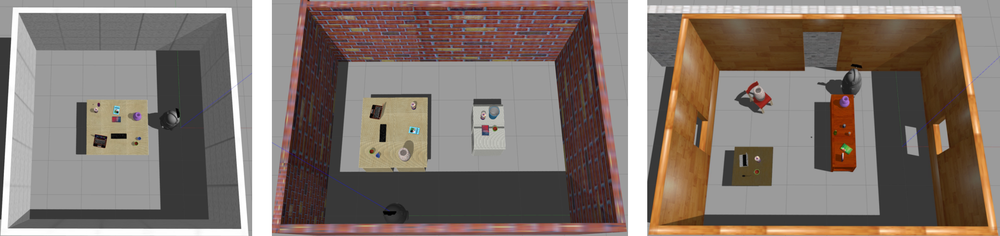
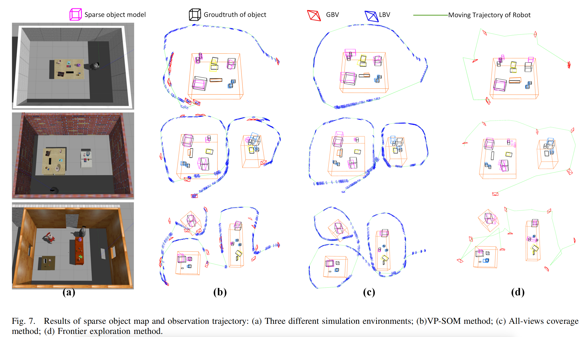

# VP-SOM
**Authors:** [Zhang Jiadong], [Wang Wei]

VP-SOM is a novel View Planning Method for Indoor Sparse Object Model based on Information Abundance and Observation Continuity. 

## 1. Prerequisites

We have tested the system in Ubuntu 18.04.
    + ROS melodic for Motion module and the connection between Motion module&View-Planning module. We suggest installing the "desktop-full" version of ROS.
    + Prerequisites of Active SLAM are the same as [**ORB_SLAM2**](https://github.com/raulmur/ORB_SLAM2), including C++11, OpenCV, Eigen3.4.10, Eigen3, Pangolin, DBoW2, g2o and PCL1.8.
    + Gazebo 9.0 for Simulization environment. 
    + Rviz for visulization of object map, camera view and robot motion.


## 2. Building

  + Create ROS workspace and download our package:

        ```
        cd {ROS_WORKSPACE}/src
        git clone https://github.com/TINY-KE/VP-SOM.git
        cd VP-SOM
        ```

  + Complie the thirdparty libraries of Active SLAM:
        
        ```
        cd Active_SLAM_based_on_VP-SOM
        chmod +x build_thirdparty.sh       
        ./build_thirdparty.sh
        ```
        
  + Complie the Active SLAM and YOLO:
        
        ```
        cd {ROS_WORKSPACE}
        catkin_make
        ```  

## 3. Usage of view planning method
There are many parameters in the file "config/kinectv1.yaml" that can affect VP-SOM. This section will introduce these parameters.
+ **[PubGlobalGoal]**: 
+ **PubLocalGoal**: 
+ **MAM.Reward_angle_cost**:
+ **MAM.Reward_dis**:
+ **Planle.Safe_radius**:
+ **ConstraintType**:
+ **ObserveMaxNumBackgroudObject**:
+ **IE.ThresholdEndMapping**:
+ **Plane.Height.Max** and **Plane.Height.Min**:
+ **IE.PublishIEwheel**:
+ **IE.P_occ**, **IE.P_free**, **IE.P_prior**:
+ **IE.ThresholdPointNum**:
+ Series of **Trobot_camera**:
+ Series of **Tworld_camer**:
+ Other parameters have little effect and will be updated in the future.

## 4. Simulization Environment and Fabo robot
+ 1. Simulization Environment
  + One backgroud object
        ```
        roslaunch ASLAM_gazebo_world hokuyo_kinectv1_bringup_moveit_1bo.launch
        ```

  + Two backgroud object
      ```
      roslaunch ASLAM_gazebo_world hokuyo_kinectv1_bringup_moveit_2bo.launch 
      ```

  + Three backgroud object
      ```
      roslaunch ASLAM_gazebo_world hokuyo_kinectv1_bringup_moveit_3bo.launch 
      ```
    <figure>
    <p align="center" >
    
    </p>
    </figure>

+ 2. Fabo robot controller
  + Control robot by keyboard. This corresponds to manual mode where PubGlobalGoal=0. Press "IJLK," to control the movement of the chassis. Press "G" to publish a signal that has arrived at the NBV to the view-planning program to start a new round of view-planning
        ```
        roslaunch fabo_teleop fabo_teleop.launch
        ```
  + Robot move autonomously by MoveIt and 2D grid map. This corresponds to autonomous mode where PubGlobalGoal=1.
        ```
        roslaunch fabo_robot_gazebo  fake_navigation.launch
        ```


## 5. Test the Active SLAM
+ 1. Start simulation environment and robot controller as the section 4

+ 2. YOLO object detection
    ```
    roslaunch darknet_ros darknet_kinectv1.launch
    ```

+ 3. Active SLAM
    ```
    roslaunch active_slam_vpsom aslam.launch
    ```
  + Visulization of object map, camera view and robot motion
        ```
        roslaunch active_slam_vpsom rviz.launch
        ```
<figure>
    <p align="center" >
    
    </p>
    </figure>


## 6. Evaluation
The results of sparse object map and observation trajectories of different view-planning methods are saved in "eval/temp". Evaluate various methods by comparing sparse object maps and observation trajectories.
    ```
    rosrun active_slam_vpsom eval 
    ```

The groudtruth of object models in the simulation environments can be extracted from the "world" file of gazebo
    ```
    rosrun active_eao_new extract_gazebo_groudth  [the path of gazebo world file]
    ```

Other details to be updated later.